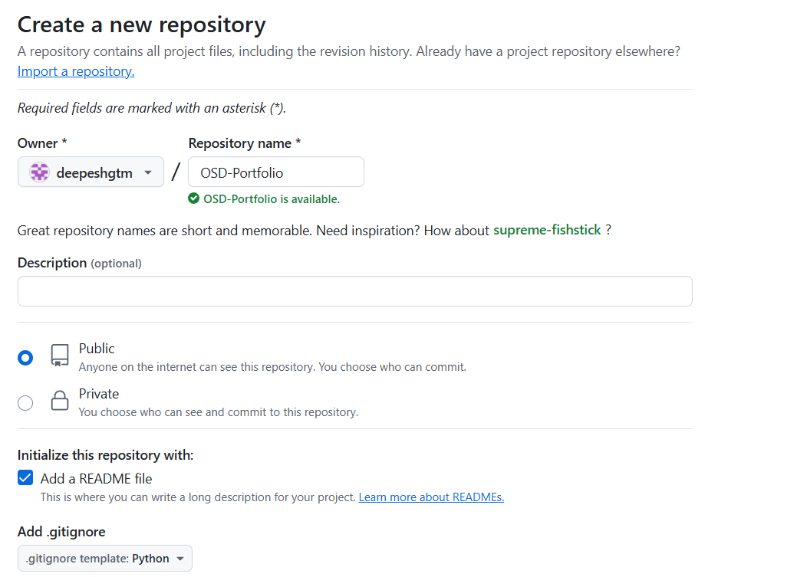
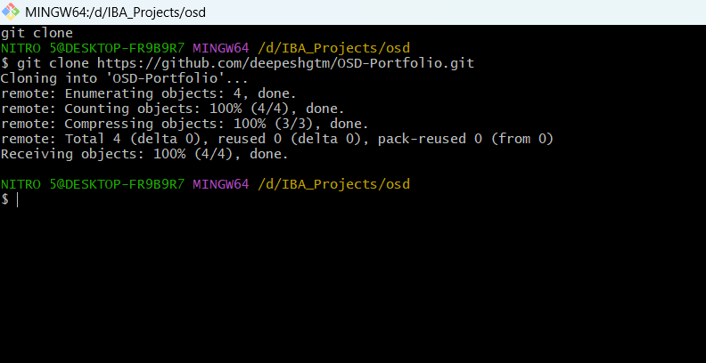
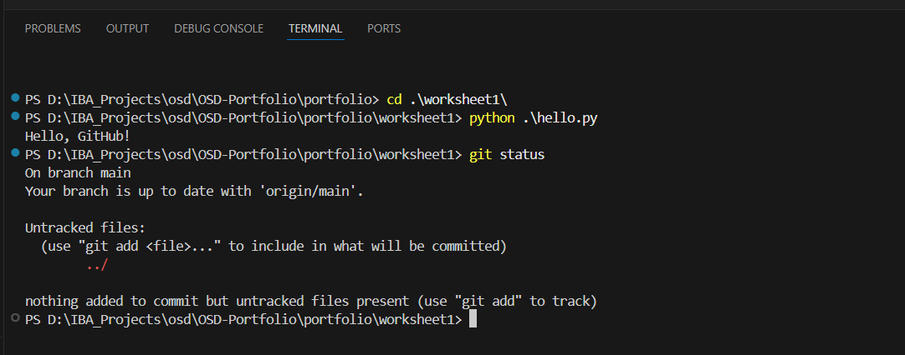
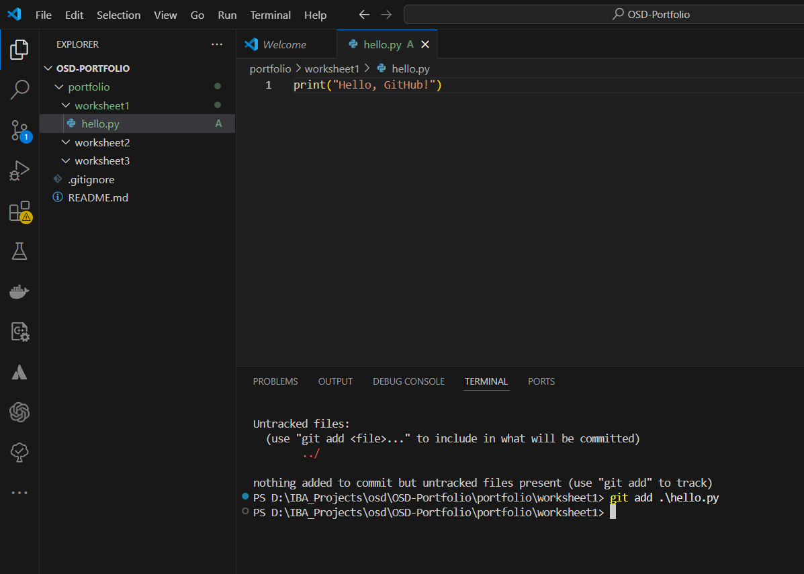
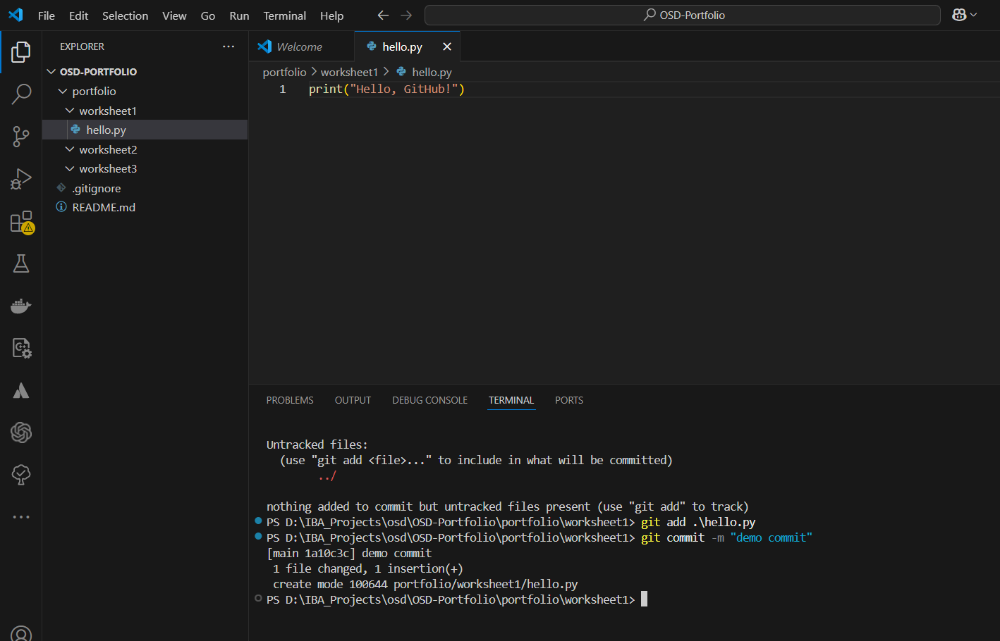
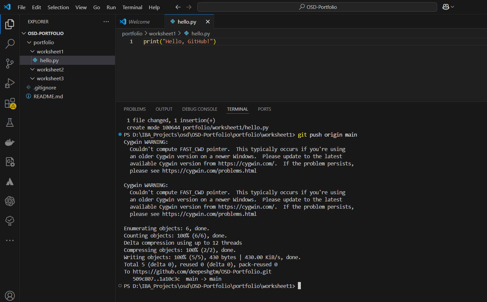
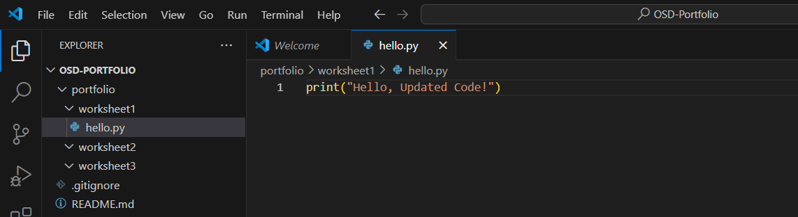
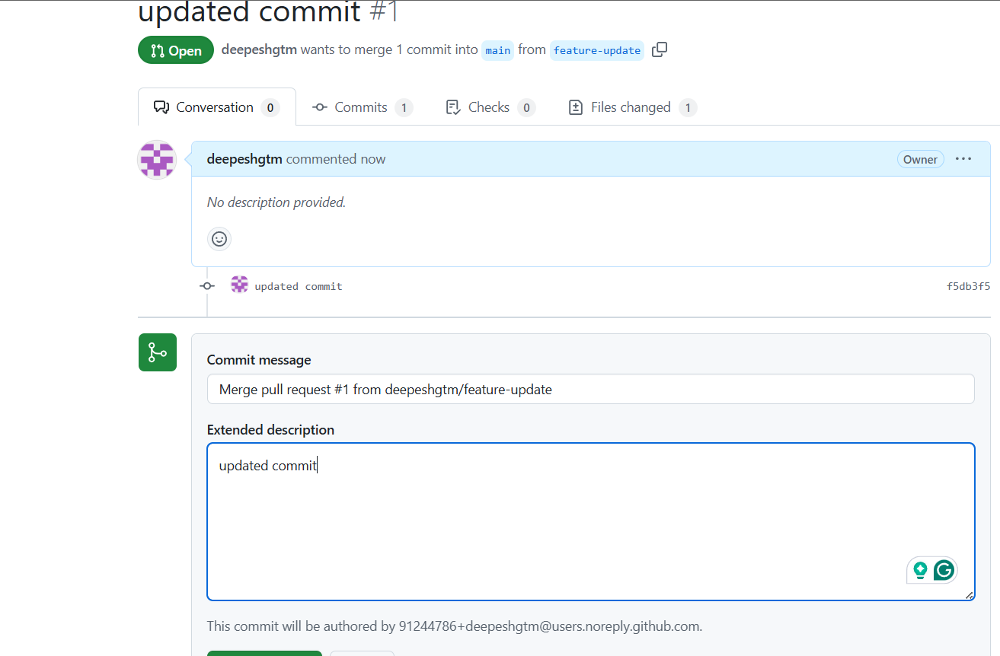
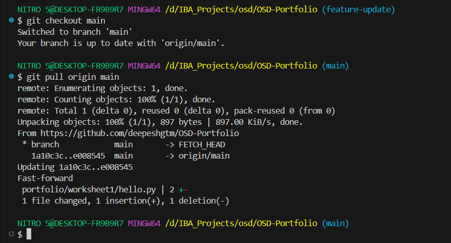

# Worksheet 1: Git Version Control

## Steps

1. Created `hello.py` and committed it to the main branch.
2. Pushed changes to GitHub using `git push`.
3. Created a feature branch with `git checkout -b feature-update`.
4. Updated `hello.py`, committed, and pushed to the feature branch.
5. Merged the feature branch into main via a Pull Request.
6. Cloned the repository to demonstrate `git clone`.

## Commands Used

- `git add portfolio/worksheet1/demo.txt`
- `git commit -m "message"`
- `git push origin main`
- `git checkout -b feature-update`
- `git pull origin main`
- `git clone <repo-url>`

## Screenshots

