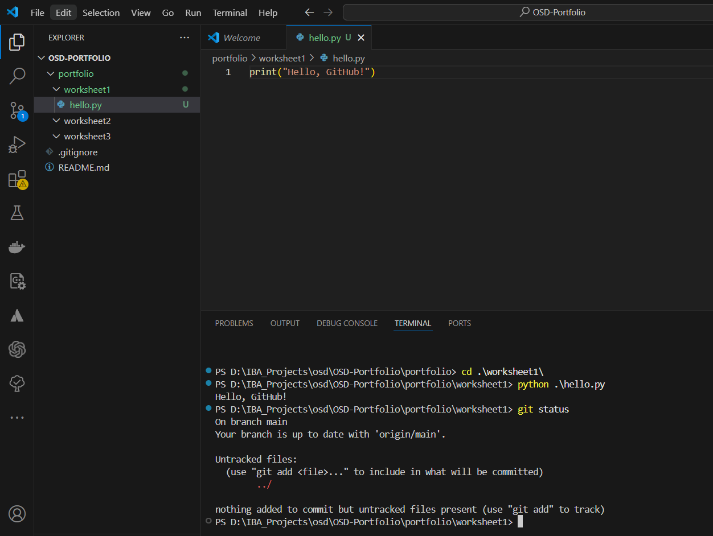
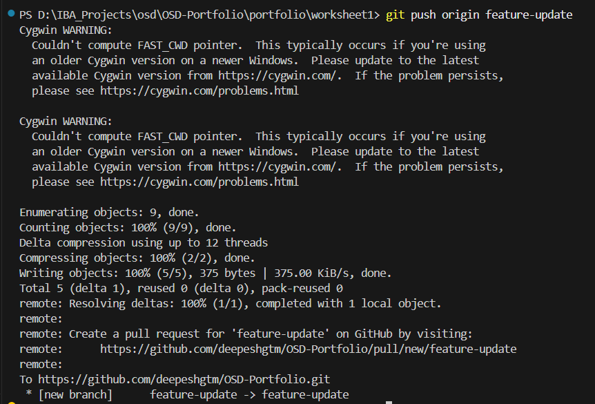
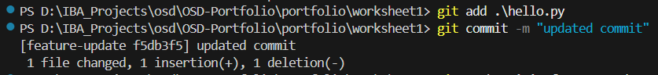

# Worksheet 1: Git Version Control

## Steps

1. Created `hello.py` and committed it to the main branch.
2. Pushed changes to GitHub using `git push`.
3. Created a feature branch with `git checkout -b feature-update`.
4. Updated `hello.py`, committed, and pushed to the feature branch.
5. Merged the feature branch into main via a Pull Request.
6. Cloned the repository to demonstrate `git clone`.

## Commands Used

- `git add portfolio/worksheet1/demo.txt`
- `git commit -m "message"`
- `git push origin main`
- `git checkout -b feature-update`
- `git pull origin main`
- `git clone <repo-url>`

## Screenshots

1. Creating new repo
   
2. Cloning new repo
   
3. Creating new python file
   
4. Git status
   
5. Git add
   
6. Git first commit
   
7. Git push
   
8. Git pull
   
9. Git create new branch
   
10. Updated Python code
    
11. Git push updated code
    
12. Git commit updated code
    
13. Git merge request
    
14. Git checkout main branch
    
