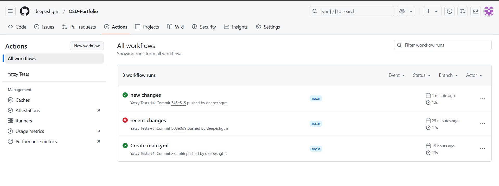

# Worksheet 2: Yatzy Class and GitHub Actions

## Overview

Implemented a Python `Yatzy` class with 5 lockable dice and scoring methods. Automated testing is set up using GitHub Actions.

## Files

- `dice_game.py`: The Yatzy class implementation.
- `test_dice_game.py`: Unit tests for all methods using pytest.
- `demo_game.py`: A script demonstrating the class in a mock game.
- `.github/workflows/test.yml`: GitHub Actions workflow for automated testing.

## Scoring Methods

- `ScoreOnes`, `ScoreTwos`, ..., `ScoreSixes`: Sum of dice with the respective number.
- `SinglePair`: Highest pair score (or 0).
- `DoublePairs`: Sum of two highest pairs (or 0).
- `TripleMatch`, `QuadMatch`: Sum of three/four identical dice (or 0).
- `SmallStraight`: 15 points for [1,2,3,4,5].
- `LargeStraight`: 20 points for [2,3,4,5,6].
- `FullSet`: 25 points for three of one kind and two of another.
- `TotalSum`: Sum of all dice.
- `AllSame`: 50 points for five identical dice.

## GitHub Actions

The workflow runs pytest on every push or pull request to the main branch. See `.github/workflows/test.yml` for details.

## Screenshots

1. Github Actions Setup for Automated testing
   Yml file for automation
   
   GitHub Workflow Folder
   
   GitHub Actions Test
   
2. Running and Testing game
   Running Mock Game
   
   Testing All functions
   
   Testing Game
   
