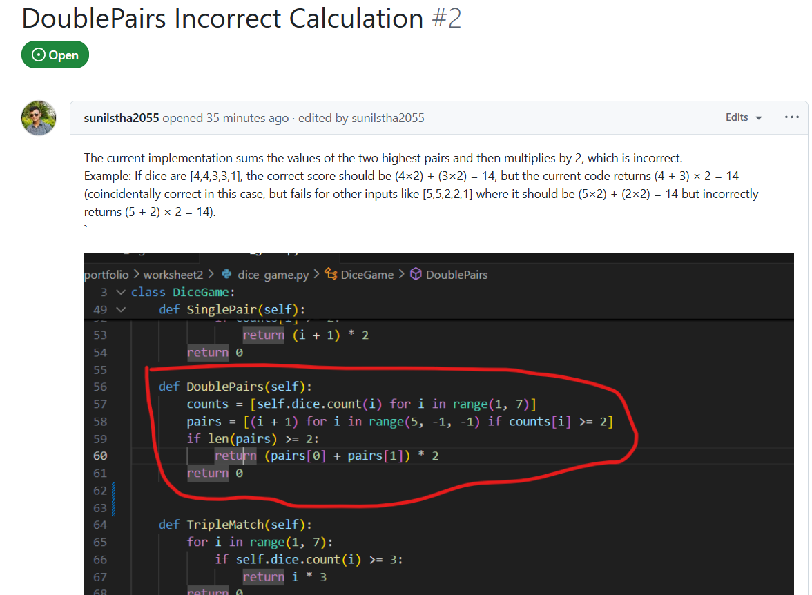
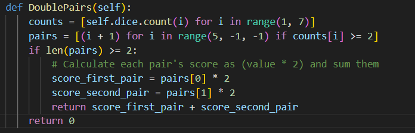
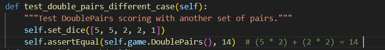
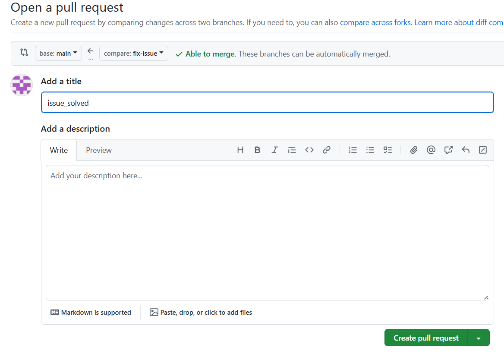
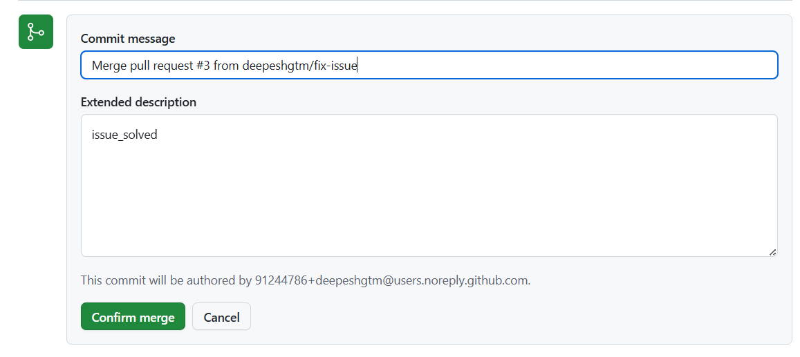
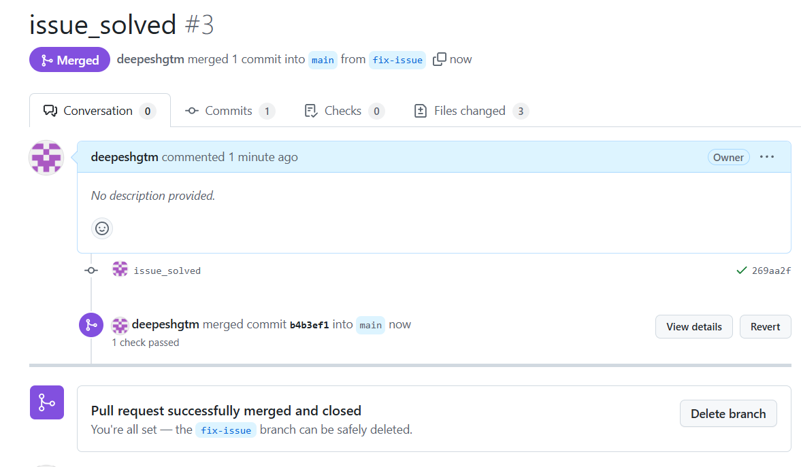

# Worksheet 3: GitHub Issues

## Overview

Collaborated with a classmate to review the Yatzy code and resolve issues using GitHub Issues.

## Steps

1. Shared repository with classmate (@sunilstha2055).
2. He created issue #1: "DoublePairs Incorrect Calculation."
3. Created branch `fix-issue` and updated `DoublePairs` method.
4. Added test case `test_double_pairs_different_case` to verify fix.
5. Merged `fix-issue` into `main` via Pull Request #2.

## Obstacles

- Ensuring `DoublePairs` only scores with exactly two pairs was initially overlooked.
- Coordinating with a classmate required clear communication.

## Concerns

- Additional edge cases in other scoring methods may need review.
- Test coverage could be expanded for robustness.

## Screenshots

1. Issue Raised on the code
   
2. Fixed code
   
3. Testing of fixed code
   
4. Pull Request
   
5. Merging Fixed Code on Main Branch
   
6. Merging Complete
   
